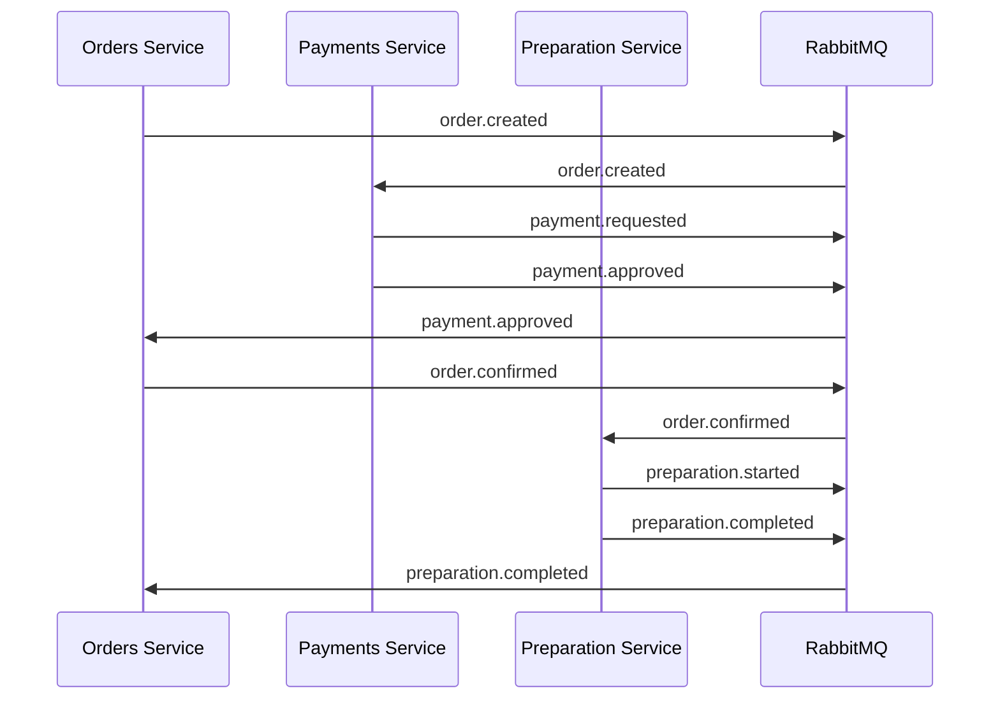

# FIAP Food RabbitMQ - Mensageria para Microsserviços

## 📋 Descrição

Este repositório contém os recursos necessários para implantar uma instância de **RabbitMQ** no cluster Kubernetes, servindo como sistema de mensageria para comunicação assíncrona entre os microsserviços da aplicação FIAP Food.

### Responsabilidades
- Gerenciar filas de mensagens entre microsserviços
- Garantir entrega confiável de mensagens
- Implementar padrões de Event Sourcing
- Facilitar desacoplamento entre serviços
- Prover persistência de mensagens

## 🏗️ Arquitetura

### Tecnologias Utilizadas
- **Message Broker**: RabbitMQ 3.12
- **Orquestração**: Kubernetes
- **Protocolo**: AMQP 0.9.1
- **Persistência**: Persistent Volumes
- **Monitoramento**: Management UI
- **Clustering**: RabbitMQ Cluster

### Padrões de Mensageria Implementados
- **Event Sourcing**: Eventos de domínio
- **Saga Pattern**: Transações distribuídas
- **Dead Letter Queue**: Tratamento de falhas
- **Retry Pattern**: Reprocessamento automático
- **Publisher Confirms**: Garantia de entrega

## 🗂️ Estrutura de Filas e Exchanges

### Exchanges Configurados
```yaml
# Orders Exchange
orders.exchange:
  type: topic
  durable: true
  routing_keys:
    - order.created
    - order.confirmed
    - order.cancelled

# Payments Exchange
payments.exchange:
  type: topic
  durable: true
  routing_keys:
    - payment.requested
    - payment.approved
    - payment.rejected

# Preparation Exchange
preparation.exchange:
  type: topic
  durable: true
  routing_keys:
    - preparation.started
    - preparation.completed
    - preparation.ready
```

### Filas por Microsserviço
```yaml
# Orders Service Queues
orders.queue:
  durable: true
  bindings:
    - exchange: payments.exchange
      routing_key: payment.approved
    - exchange: preparation.exchange
      routing_key: preparation.ready

# Payments Service Queues
payments.queue:
  durable: true
  bindings:
    - exchange: orders.exchange
      routing_key: order.confirmed

# Preparation Service Queues
preparation.queue:
  durable: true
  bindings:
    - exchange: orders.exchange
      routing_key: order.confirmed
```

## 🚀 Deploy no Kubernetes

### Manifesto de Deployment
```yaml
# deployment.yaml
apiVersion: apps/v1
kind: Deployment
metadata:
  name: rabbitmq
  namespace: fiap-food
spec:
  replicas: 1
  selector:
    matchLabels:
      app: rabbitmq
  template:
    metadata:
      labels:
        app: rabbitmq
    spec:
      containers:
      - name: rabbitmq
        image: rabbitmq:3.12-management
        ports:
        - containerPort: 5672
          name: amqp
        - containerPort: 15672
          name: management
        env:
        - name: RABBITMQ_DEFAULT_USER
          valueFrom:
            secretKeyRef:
              name: rabbitmq-secret
              key: username
        - name: RABBITMQ_DEFAULT_PASS
          valueFrom:
            secretKeyRef:
              name: rabbitmq-secret
              key: password
        volumeMounts:
        - name: rabbitmq-data
          mountPath: /var/lib/rabbitmq
      volumes:
      - name: rabbitmq-data
        persistentVolumeClaim:
          claimName: rabbitmq-pvc
```

### Service Configuration
```yaml
# service.yaml
apiVersion: v1
kind: Service
metadata:
  name: rabbitmq-service
  namespace: fiap-food
spec:
  selector:
    app: rabbitmq
  ports:
  - name: amqp
    port: 5672
    targetPort: 5672
  - name: management
    port: 15672
    targetPort: 15672
  type: ClusterIP
```

### Persistent Volume
```yaml
# pvc.yaml
apiVersion: v1
kind: PersistentVolumeClaim
metadata:
  name: rabbitmq-pvc
  namespace: fiap-food
spec:
  accessModes:
  - ReadWriteOnce
  resources:
    requests:
      storage: 5Gi
  storageClassName: gp2
```

## 🔧 Configuração dos Microsserviços

### Conexão dos Microsserviços
```typescript
// Configuração comum nos microsserviços
const rabbitmqConfig = {
  connection: {
    hostname: 'rabbitmq-service.fiap-food.svc.cluster.local',
    port: 5672,
    username: process.env.RABBITMQ_USER,
    password: process.env.RABBITMQ_PASS,
    vhost: '/'
  },
  exchanges: {
    orders: 'orders.exchange',
    payments: 'payments.exchange',
    preparation: 'preparation.exchange'
  },
  queues: {
    orders: 'orders.queue',
    payments: 'payments.queue',
    preparation: 'preparation.queue'
  }
};
```

### Exemplo de Publisher (Orders Service)
```typescript
// orders-service/src/events/order-created.publisher.ts
import { EventPublisher } from '@lib/amqp';

export class OrderCreatedPublisher extends EventPublisher {
  exchange = 'orders.exchange';
  routingKey = 'order.created';

  async publish(data: OrderCreatedEvent) {
    await this.publishMessage(data);
  }
}
```

### Exemplo de Consumer (Payments Service)
```typescript
// payments-service/src/events/order-confirmed.consumer.ts
import { EventConsumer } from '@lib/amqp';

export class OrderConfirmedConsumer extends EventConsumer {
  exchange = 'orders.exchange';
  queue = 'payments.queue';
  routingKey = 'order.confirmed';

  async processMessage(data: OrderConfirmedEvent) {
    // Processar criação de pagamento
    await this.createPayment(data);
  }
}
```

## 🔄 Fluxo de Mensagens

### Fluxo de Pedido Completo


### Eventos de Domínio
```typescript
// Definição dos eventos
interface OrderCreatedEvent {
  order_id: string;
  customer_id: string;
  items: OrderItem[];
  total_amount: number;
  timestamp: Date;
}

interface PaymentApprovedEvent {
  payment_id: string;
  order_id: string;
  amount: number;
  timestamp: Date;
}

interface PreparationCompletedEvent {
  preparation_id: string;
  order_id: string;
  status: 'READY' | 'COMPLETED';
  timestamp: Date;
}
```

## 📊 Monitoramento e Observabilidade

### Management UI
- **URL**: `http://rabbitmq-service:15672`
- **Usuário**: Configurado via Secret
- **Funcionalidades**:
  - Visualização de filas e exchanges
  - Monitoramento de mensagens
  - Métricas de performance
  - Logs de auditoria

### Métricas Importantes
```bash
# Verificar status das filas
kubectl exec -it rabbitmq-pod -n fiap-food -- rabbitmqctl list_queues

# Verificar exchanges
kubectl exec -it rabbitmq-pod -n fiap-food -- rabbitmqctl list_exchanges

# Verificar conexões
kubectl exec -it rabbitmq-pod -n fiap-food -- rabbitmqctl list_connections

# Verificar consumidores
kubectl exec -it rabbitmq-pod -n fiap-food -- rabbitmqctl list_consumers
```

### Alertas Configurados
- ✅ Filas com muitas mensagens não processadas
- ✅ Conexões perdidas
- ✅ Disco cheio
- ✅ Memória alta
- ✅ Mensagens na DLQ

## 🔒 Segurança

### Credenciais
```yaml
# secrets.yaml
apiVersion: v1
kind: Secret
metadata:
  name: rabbitmq-secret
  namespace: fiap-food
type: Opaque
data:
  username: <base64_encoded_username>
  password: <base64_encoded_password>
```

### Network Policies
```yaml
# network-policy.yaml
apiVersion: networking.k8s.io/v1
kind: NetworkPolicy
metadata:
  name: rabbitmq-network-policy
  namespace: fiap-food
spec:
  podSelector:
    matchLabels:
      app: rabbitmq
  policyTypes:
  - Ingress
  - Egress
  ingress:
  - from:
    - podSelector:
        matchLabels:
          app: orders-service
    - podSelector:
        matchLabels:
          app: payments-service
    - podSelector:
        matchLabels:
          app: preparation-service
    ports:
    - protocol: TCP
      port: 5672
```

## 🛠️ Troubleshooting

### Comandos Úteis
```bash
# Verificar status do pod
kubectl get pods -n fiap-food | grep rabbitmq

# Verificar logs
kubectl logs -n fiap-food deployment/rabbitmq

# Acessar shell do container
kubectl exec -it rabbitmq-pod -n fiap-food -- /bin/bash

# Port-forward para acessar Management UI
kubectl port-forward -n fiap-food svc/rabbitmq-service 15672:15672

# Verificar consumo de recursos
kubectl top pod -n fiap-food | grep rabbitmq
```

### Problemas Comuns
1. **Conexões recusadas**: Verificar service e credenciais
2. **Filas cheias**: Verificar consumidores ativos
3. **Mensagens perdidas**: Verificar configuração de durabilidade
4. **Performance baixa**: Verificar recursos e índices

## 🔄 Backup e Recuperação

### Backup de Definições
```bash
# Backup das definições (filas, exchanges, etc.)
kubectl exec -it rabbitmq-pod -n fiap-food -- rabbitmqctl export_definitions /tmp/definitions.json

# Copiar backup para local
kubectl cp fiap-food/rabbitmq-pod:/tmp/definitions.json ./definitions.json
```

### Restore de Definições
```bash
# Copiar definições para pod
kubectl cp ./definitions.json fiap-food/rabbitmq-pod:/tmp/definitions.json

# Restaurar definições
kubectl exec -it rabbitmq-pod -n fiap-food -- rabbitmqctl import_definitions /tmp/definitions.json
```

## 📈 Otimizações de Performance

### Configurações Recomendadas
```yaml
# rabbitmq.conf
vm_memory_high_watermark.relative = 0.6
disk_free_limit.relative = 0.1
cluster_partition_handling = pause_minority
heartbeat = 60
frame_max = 131072
channel_max = 2048
```

### Clustering (Para Produção)
```yaml
# Para ambiente de produção, considere clustering
apiVersion: apps/v1
kind: StatefulSet
metadata:
  name: rabbitmq-cluster
spec:
  serviceName: rabbitmq-nodes
  replicas: 3
  # ... configuração de clustering
```

## 📚 Documentação Adicional

A documentação completa do projeto pode ser visualizada na página principal: [FIAP Food Docs](https://github.com/thallis-andre/fiap-food-docs)

## 👨‍💻 Autor

- **Thallis André Faria Moreira** - RM360145
